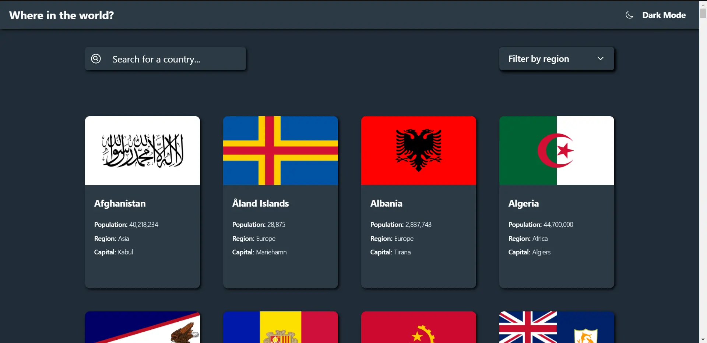

# Frontend Mentor - REST Countries API with color theme switcher solution

This is a solution to the [REST Countries API with color theme switcher challenge on Frontend Mentor](https://www.frontendmentor.io/challenges/rest-countries-api-with-color-theme-switcher-5cacc469fec04111f7b848ca). Frontend Mentor challenges help you improve your coding skills by building realistic projects.

## Table of contents

- [Overview](#overview)
  - [The challenge](#the-challenge)
  - [Screenshot](#screenshot)
  - [Links](#links)
- [My process](#my-process)
  - [Built with](#built-with)
  - [What I learned](#what-i-learned)
  - [Continued development](#continued-development)
  - [Useful resources](#useful-resources)
- [Author](#author)
- [Acknowledgments](#acknowledgments)


## Overview

### The challenge

Users should be able to:

- See all countries from the API on the homepage
- Search for a country using an `input` field
- Filter countries by region
- Click on a country to see more detailed information on a separate page
- Click through to the border countries on the detail page
- Toggle the color scheme between light and dark mode *(optional)*

### Screenshot



### Links

- Solution URL: [https://github.com/djblackett/rest-countries-api]
- Live Site URL: [https://djblackett.github.io/rest-countries-api/]

## My process

This project began as something to build while learning Styled Components and React Router. I had already built projects with React and Redux, so this was the next step. After finishing the project, I decided to go back to it to practice/learn new skills. I converted the project files to Typescript. Also, the main page load was a bit slow, so I looked into ways to optimize it.

#### Optimizations

- upgraded React to version 18 to see if the new concurrency features would help
- optimized the API call by adding query params that filtered the data to only include the fields I actually needed.
This reduced the response size significantly. The API does not do pagination, so optimizing the initial load is difficult. I may experiment with caching the first few countries to load immediately while the rest load in the background.  
- recreated the grid with `react-window` to only render countries as they are needed while scrolling. *** This broke some features of the site, so I went back to my original grid design
- memoized many components, properties, and functions with `React.memo`, `useMemo`, and `useCallback`.
- used React Suspense to lazy load the grid items and display the loading state

### Built with

- Semantic HTML5 markup
- Flexbox
- CSS Grid
- [React](https://reactjs.org/) - JS library
- [CreateReactApp](https://create-react-app.dev/) - React framework
- [Styled Components](https://styled-components.com/) - For styles
- [React Router](https://reactrouter.com/) - Client-side routing
- [Typescript](https://www.typescriptlang.org/) - Static Type Checking
- [Redux Toolkit](https://redux-toolkit.js.org/) - Global State Management
- [react-window](https://react-window.vercel.app/) - Grid Virtualization


### What I learned

Use this section to recap over some of your major learnings while working through this project. Writing these out and providing code samples of areas you want to highlight is a great way to reinforce your own knowledge.

To see how you can add code snippets, see below:

```html
<h1>Some HTML code I'm proud of</h1>
```

```css
.proud-of-this-css {
  color: papayawhip;
}
```

```js
const proudOfThisFunc = () => {
  console.log('🎉')
}
```


### Continued development

Use this section to outline areas that you want to continue focusing on in future projects. These could be concepts you're still not completely comfortable with or techniques you found useful that you want to refine and perfect.

#### Typescript

Typescript was added after the project was already completed, which is a pretty artificial way to use Typescript. I would like to continue learning and using Typescript, but from the very beginning of a project to reap most of its benefits. There are a few places where I struggled with the type definitions and ended up resorting to `any` as the type, which is certainly not ideal, so I hope to fill in those gaps in future projects and make sure I'm using Typescript to its fullest extent. Using typescript with redux-toolkit and asyncThunks was a challenge and I'm not sure I really understand the type annotation on `builder` in the `extraReducers` property.

#### Data Fetching

The redux code for async data fetching feels a bit excessive, so I may try some data fetching libraries like React Query in future projects. Another possibility for enhancing performance would be to set up a relay server that fetches the info needed from the API once per day and then responds to GET requests with a paginated version of the data. This would make using an infinite loader possible.


### Useful resources

- [Example resource 1](https://www.example.com) - This helped me for XYZ reason. I really liked this pattern and will use it going forward.
- [Example resource 2](https://www.example.com) - This is an amazing article which helped me finally understand XYZ. I'd recommend it to anyone still learning this concept.

**Note: Delete this note and replace the list above with resources that helped you during the challenge. These could come in handy for anyone viewing your solution or for yourself when you look back on this project in the future.**

## Author

- Website - [Dave Andrea](https://daveandrea.com)
- Frontend Mentor - [@djblackett](https://www.frontendmentor.io/profile/djblackett)


## Acknowledgments

This is where you can give a hat tip to anyone who helped you out on this project. Perhaps you worked in a team or got some inspiration from someone else's solution. This is the perfect place to give them some credit.

**Note: Delete this note and edit this section's content as necessary. If you completed this challenge by yourself, feel free to delete this section entirely.**
